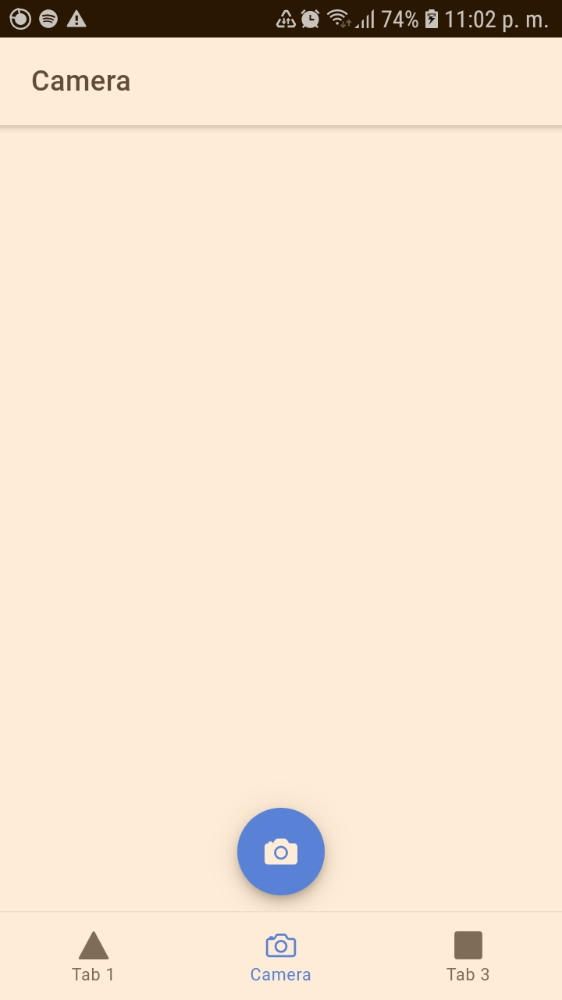
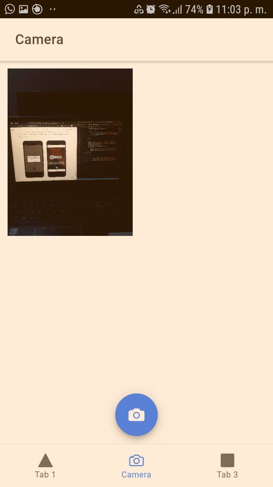

## Firts Ionic App
This app implements a camera functionality using the capacitor library.  

## Screenshoots
### The app installed in the mobile device (SAMSUNG J5 PRIME)
  
 

### The app execution in the mobile device
  
 

### Photo taken with the Camera App
  
 

### Photo taken in the web browser

